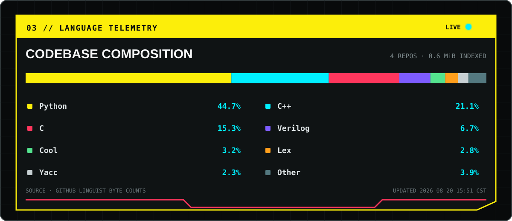

  

  

  <a href="https://github.com/ethanwod/XJTU-CS2020"><code>[ OPEN // XJTU-CS2020 ]</code></a>
  &nbsp;&nbsp;
  <a href="https://github.com/ethanwod?tab=repositories"><code>[ BROWSE // ALL REPOSITORIES ]</code></a>

  
<code>ACCESSIBLE TEXT LOG</code>

  Computer science learner exploring algorithms, operating systems, networks,
  compilers, artificial intelligence, computer vision, and embedded intelligent
  systems. Featured archive: [XJTU-CS2020](https://github.com/ethanwod/XJTU-CS2020).

